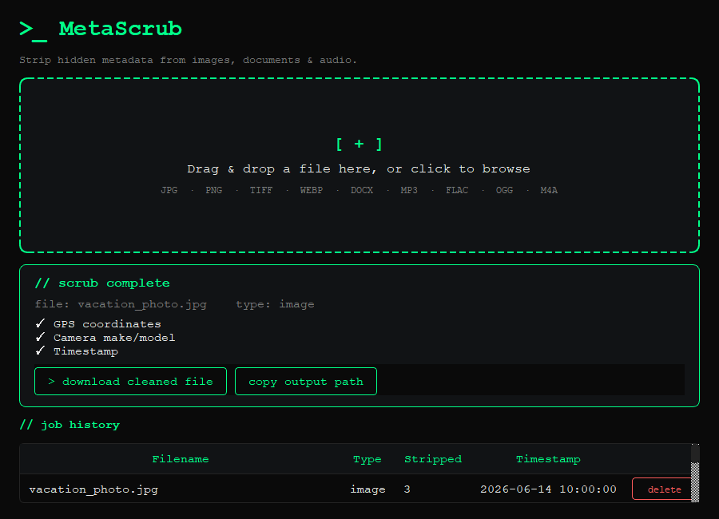

# >_ MetaScrub

> Strip hidden metadata from images, documents & audio — privately, on your machine.

No cloud. No uploads. No tracking. Your files never leave your device.



---

## What it does

Every file you create carries invisible metadata — GPS coordinates baked into
phone photos, your name and company embedded in Word docs, recording equipment
details hidden in audio files. MetaScrub strips all of it in seconds.

| Format | What gets stripped |
|--------|-------------------|
| JPG, PNG, TIFF, WEBP | GPS location, camera make/model, timestamps, all EXIF data |
| DOCX | Author, company, last modified by, revision history, created/modified dates |
| MP3, FLAC, OGG, M4A | Artist, album, title, encoder, year, genre, cover art |

---

## Installation

**Requirements:** Python 3.10+

```bash
git clone https://github.com/cookiesn1ffer/MetaScrub.git
cd MetaScrub
python -m venv venv
venv\Scripts\activate      # Windows
source venv/bin/activate   # Linux
pip install -r requirements_gui.txt
python gui.py
```

---

## Build standalone executable

```bash
python build.py
# Windows: dist/MetaScrub-windows.exe
# Linux:   dist/MetaScrub-linux
```

No Python required on the target machine.

---

## Stack

- **PyQt6** — native desktop UI
- **Pillow** — image EXIF/GPS stripping
- **python-docx** — document metadata stripping  
- **mutagen** — audio tag stripping
- **SQLite** — local job history

---

## License

Copyright (c) 2026 Aarush (cookiesn1ffer). All rights reserved.
This software is proprietary. See LICENSE for details.
